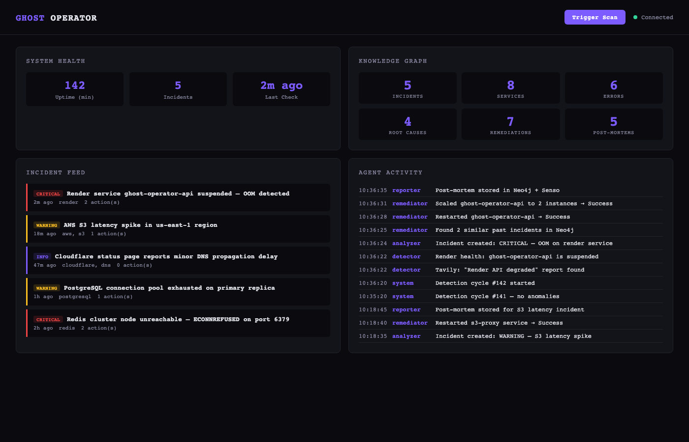

# Ghost Operator

An autonomous infrastructure agent. It detects incidents, figures out what broke, fixes it, and writes a post-mortem — then uses that post-mortem to handle the next incident better.

## In Simple Terms

Your app is running on cloud servers. One of them crashes at 3 AM. Normally, an engineer gets paged, wakes up, SSH's in, pokes around logs, restarts the service, maybe scales it up, then spends 30 minutes writing an incident report.

Ghost Operator replaces that entire workflow. It's constantly scanning — checking your Render services, searching the web for outage reports, monitoring status pages and community forums. When it picks up a signal that something is wrong, it kicks off a pipeline:

1. It figures out *what* broke — which service, what error codes showed up, how bad it is.
2. It checks its memory: "Have I seen this before? What fixed it last time?"
3. It takes action — restarts the service, scales it up, whatever the situation calls for.
4. It writes a post-mortem and saves it, so next time it has more context.

The key thing: it gets better over time. Every incident becomes a node in a knowledge graph. Every post-mortem becomes searchable memory. The agent that handles incident #50 is meaningfully smarter than the one that handled incident #1.

## Architecture

```
┌─────────────────────────────────────────────────────────────────┐
│                       GHOST OPERATOR                             │
│                                                                  │
│  ┌──────────┐   ┌──────────┐   ┌────────────┐   ┌───────────┐  │
│  │  DETECT  │──>│ ANALYZE  │──>│ KNOWLEDGE  │──>│    ACT    │  │
│  │          │   │          │   │            │   │           │  │
│  │ Yutori   │   │ Entity   │   │ Neo4j      │   │ Render    │  │
│  │ Tavily   │   │ Severity │   │ Senso      │   │ Restart   │  │
│  │ Render   │   │ Classify │   │            │   │ Scale     │  │
│  └──────────┘   └──────────┘   └────────────┘   └───────────┘  │
│        │                                                │       │
│        └───────────── 60-second cycle ──────────────────┘       │
│                                                                  │
│  ┌───────────────────────────────────────────────────────────┐   │
│  │  REST API  ·  SSE Stream  ·  Dashboard  ·  Health Check   │   │
│  └───────────────────────────────────────────────────────────┘   │
└─────────────────────────────────────────────────────────────────┘
```

## Pipeline

Every 60 seconds (or on-demand via **Trigger Scan**):

1. **Detect** — Query Render health API, search Tavily for outage reports, poll Yutori scouts
2. **Analyze** — Extract service names + error codes, classify severity, infer root cause
3. **Remediate** — Check Neo4j/Senso for past similar incidents, then act via Render API (restart, scale, resume)
4. **Report** — Generate post-mortem, store in Neo4j graph + Senso memory, broadcast to dashboard

If no signals are found, the cycle exits early.

## Service Integrations

| Tool | What it does here |
|------|-------------------|
| **Tavily** | Web search for real-time outage reports and status page updates |
| **Yutori** | Continuous scouting of status pages, Reddit, HN for incident keywords |
| **Neo4j** | Knowledge graph — incidents, services, errors, root causes, remediations all linked |
| **Render** | Hosts the agent + target for self-healing (restart, scale via API) |
| **Senso.ai** | Stores post-mortems as searchable agent memory |

## Knowledge Graph

```
                       ┌──────────┐
              AFFECTS──>│ Service  │
              │         └──────────┘
 ┌──────────┐─┤
 │ Incident │  │HAS_ERROR──>┌──────────┐
 └──────────┘  │            │  Error   │
               │            └──────────┘
               │CAUSED_BY──>┌───────────┐
               │            │ RootCause │
               │            └───────────┘
               │REMEDIATED_BY──>┌─────────────┐
               │                │ Remediation │
               │                └─────────────┘
               │HAS_POSTMORTEM──>┌────────────┐
               └                 │ PostMortem │
                                 └────────────┘
```

The remediator queries this graph before acting. Past incidents with similar services/errors surface what worked before.

## Example Incident

Here's what it looks like when Ghost Operator handles a real incident end-to-end:

> **Scenario:** A Render-hosted API service crashed due to memory exhaustion (OOM). Ghost Operator detected the suspended service, identified the root cause, restarted it, scaled to 2 instances for resilience, and wrote a post-mortem — all within 15 seconds, with zero human intervention.

```
Incident Timeline
─────────────────
10:34:22  [DETECT]     Render health check: ghost-operator-api is suspended
10:34:23  [DETECT]     Tavily: "Render API degraded performance" reported
10:34:25  [ANALYZE]    Severity: CRITICAL | Services: render | Error: OOM
10:34:25  [ANALYZE]    Root cause: Memory exhaustion
10:34:28  [REMEDIATE]  Restarted ghost-operator-api → Success
10:34:31  [REMEDIATE]  Scaled ghost-operator-api to 2 instances → Success
10:34:35  [REPORT]     Post-mortem generated and stored in Neo4j + Senso
10:34:35  [SYSTEM]     Cycle complete — service recovered
```

The post-mortem from this incident is now stored in the knowledge graph. Next time a similar OOM event occurs, the remediator will find this record and already know that restart + scale worked.

## Dashboard

Live at `/dashboard`. Real-time health stats, incident feed (color-coded by severity), agent activity log, and knowledge graph counts — all updated via SSE.



**Trigger Scan** — Fires the full pipeline immediately instead of waiting for the next 60s cycle. Hits `POST /api/trigger`.

## API

| Endpoint | Method | What |
|----------|--------|------|
| `/health` | GET | Health check |
| `/dashboard` | GET | Dashboard UI |
| `/events` | GET | SSE stream |
| `/api/incidents` | GET | All incidents |
| `/api/incidents/:id` | GET | Single incident |
| `/api/activity` | GET | Last 100 log entries |
| `/api/graph/stats` | GET | Node counts by type |
| `/api/graph` | GET | Full graph (nodes + edges) |
| `/api/trigger` | POST | Run detection cycle now |

## Setup

```bash
git clone https://github.com/arhrid/ghost_operator.git
cd ghost_operator
npm install
cp .env.example .env   # fill in your API keys
```

For Neo4j, create a free sandbox at [sandbox.neo4j.com](https://sandbox.neo4j.com) and drop the Bolt URL + credentials into `.env`. No schema setup needed — nodes are created on first run.

```bash
npm run dev             # development
npm run build && npm start  # production
```

Dashboard at `http://localhost:3000/dashboard`.

### Deploy to Render

`render.yaml` is included. Push to GitHub, create a Blueprint on Render, set env vars, done.

## Project Structure

```
src/
├── index.ts              # Orchestrator, Express server, cron, SSE
├── config.ts             # Env var loading
├── types/index.ts        # Shared types
├── agents/
│   ├── detector.ts       # Tavily + Yutori + Render health
│   ├── analyzer.ts       # Entity extraction, severity, root cause
│   ├── remediator.ts     # Past-incident lookup + Render actions
│   └── reporter.ts       # Post-mortem generation + storage
├── services/
│   ├── tavily.ts         # Tavily search client
│   ├── yutori.ts         # Yutori scouting client
│   ├── neo4j.ts          # Neo4j graph client
│   ├── render.ts         # Render API client
│   └── senso.ts          # Senso memory client
└── dashboard/
    └── index.html        # Single-page dashboard
```

## Stack

TypeScript, Node.js, Express, Neo4j Driver, Axios, node-cron.
